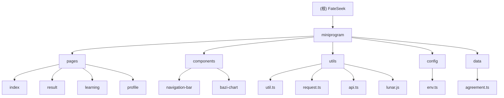

# FateSeek - 生辰八字测算小程序

## 项目愿景
FateSeek 是一个基于微信小程序平台的生辰八字测算应用，致力于传承和发扬中国传统命理文化，为用户提供理性、科学的命理分析服务。项目倡导以积极正面的态度看待传统文化，强调个人努力的重要性，避免迷信色彩。

## 架构总览

### 技术架构
- **前端框架**: 微信小程序原生框架
- **编程语言**: TypeScript (严格模式)
- **样式预处理器**: Less
- **核心依赖**: lunar-typescript (农历计算库)
- **AI 分析**: 硅基流动 API (DeepSeek 模型)

### 项目结构
```
FateSeek/
├── miniprogram/                    # 小程序主目录
│   ├── pages/                      # 页面文件
│   │   ├── index/                  # 首页（信息输入）
│   │   ├── result/                 # 结果页面（八字分析）
│   │   ├── learning/               # 学习页面（知识普及）
│   │   └── profile/                # 个人中心
│   ├── components/                 # 公共组件
│   │   ├── navigation-bar/         # 导航栏组件
│   │   └── bazi-chart/            # 八字图表组件
│   ├── utils/                      # 工具函数
│   │   ├── util.ts                 # 八字计算核心
│   │   ├── request.ts              # 网络请求封装
│   │   ├── api.ts                  # API 接口
│   │   └── lunar.js                # 农历计算库
│   ├── config/                     # 配置文件
│   │   └── env.ts                  # 环境配置
│   ├── data/                       # 静态数据
│   │   └── agreement.ts            # 用户协议
│   └── towxml/                     # Markdown 渲染组件
├── typings/                        # TypeScript 类型定义
└── node_modules/                   # 依赖包
```

## ✨ 模块结构图



## 模块索引

| 模块路径 | 职责描述 | 核心功能 | 技术栈 |
|---------|---------|---------|-------|
| `miniprogram/pages/index` | 用户信息输入页面 | 表单收集、日期时间选择、地区选择、用户协议 | TypeScript, 小程序表单组件 |
| `miniprogram/pages/result` | 八字分析结果展示 | AI 分析、八字图表、流式响应、Markdown 渲染 | 流式 API, towxml, 自定义组件 |
| `miniprogram/pages/learning` | 命理知识学习 | 文章列表、知识普及 | 小程序页面 |
| `miniprogram/pages/profile` | 个人中心 | 用户信息管理 | 小程序页面 |
| `miniprogram/components/bazi-chart` | 八字数据可视化 | 四柱展示、五行标注、颜色分类 | TypeScript, Less, 组件通信 |
| `miniprogram/components/navigation-bar` | 导航栏组件 | 页面导航 | 小程序组件 |
| `miniprogram/utils/util.ts` | 八字计算核心 | 农历转换、八字计算、天干地支处理 | lunar-typescript |
| `miniprogram/utils/request.ts` | 网络请求封装 | API 调用、错误处理、认证管理 | 微信小程序 API |
| `miniprogram/config/env.ts` | 环境配置 | API 密钥、模型参数、环境变量 | TypeScript |
| `miniprogram/data/agreement.ts` | 用户协议 | 法律条款、免责声明 | 静态数据 |

## 运行与开发

### 开发环境要求
- 微信开发者工具
- Node.js (用于依赖管理)
- TypeScript 支持

### 开发命令
项目使用微信开发者工具进行开发和调试，没有额外的 npm scripts。

### 配置文件
- `project.config.json`: 微信小程序项目配置
- `tsconfig.json`: TypeScript 严格模式配置
- `package.json`: 依赖管理（lunar-typescript）

### 开发注意事项
- 使用严格的 TypeScript 配置，包括空值检查、隐式 any 检查等
- 样式使用 Less 预处理器
- 组件采用微信小程序自定义组件规范
- API 调用使用流式响应处理

## 测试策略

### 当前测试状态
项目目前暂无自动化测试框架，依赖手动测试。

### 建议测试范围
1. **功能测试**
   - 八字计算准确性验证
   - 日期时间选择器边界情况
   - API 流式响应处理
   - 页面跳转和数据传递

2. **兼容性测试**
   - 不同微信版本兼容性
   - 不同设备屏幕适配

3. **用户体验测试**
   - 表单交互流畅性
   - 加载状态展示
   - 错误提示友好性

## 编码规范

### TypeScript 规范
- 启用严格模式，包括所有严格检查选项
- 使用接口定义数据结构
- 避免使用 `any` 类型，优先使用具体类型
- 使用函数类型签名确保类型安全

### 组件开发规范
- 使用 `properties` 定义组件属性
- 使用 `observers` 监听数据变化
- 实现合适的样式隔离策略
- 组件文件命名采用 kebab-case

### 代码组织规范
- 工具函数放在 `utils` 目录
- 配置文件集中管理
- 类型定义使用接口而非类型别名
- 避免深层嵌套的数据结构

## AI 使用指引

### AI 分析集成
项目集成硅基流动 API，使用 DeepSeek 模型进行八字分析：

1. **分析流程**
   - 用户输入基本信息 → 计算八字 → AI 分析 → 流式返回结果

2. **提示词策略**
   - 结构化分析请求
   - 要求思考过程和最终结果分离
   - 强调积极正面的分析导向
   - 避免迷信色彩，强调个人努力

3. **响应处理**
   - 支持流式数据接收
   - UTF-8 解码处理
   - Markdown 格式渲染
   - 错误处理和重试机制

### AI 配置管理
- API 密钥配置在 `env.ts`
- 模型参数可调节（temperature、max_tokens 等）
- 支持流式响应处理
- 内置错误处理和用户提示

## 变更记录 (Changelog)

### 2025-10-28
- 初始化项目架构文档
- 完成模块结构分析
- 建立开发规范指引

### 历史重要更新
- **2024-03-13**: 组件拆分优化，将 result 页面组件化
- **2024-03-07**: 农历/阳历切换功能优化
- **2024-03-06**: 八字计算功能重构，支持完整日期时间
- **2024-03-05**: 结果页面优化，新增八字图表组件
- **2024-03-04**: 首页表单优化，添加用户协议功能

## 注意事项

1. **API 密钥安全**: 确保生产环境中 API 密钥的安全性
2. **用户隐私**: 严格遵守用户隐私保护要求
3. **内容合规**: 确保分析内容符合法律法规，避免封建迷信
4. **性能优化**: 注意小程序包体积限制和加载性能
5. **错误处理**: 完善各种异常情况的处理逻辑